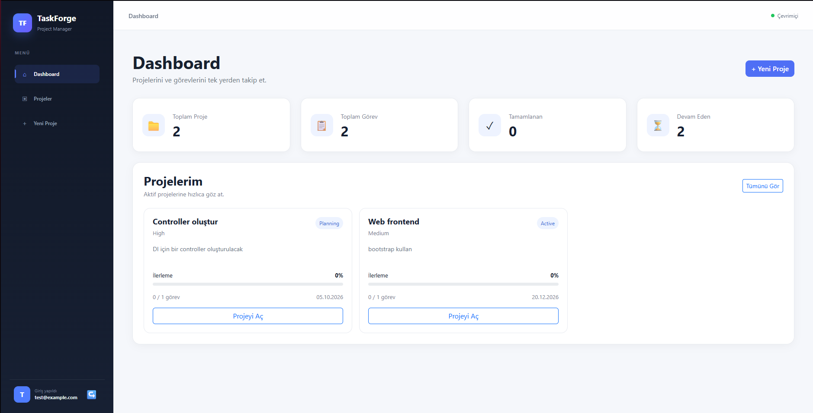
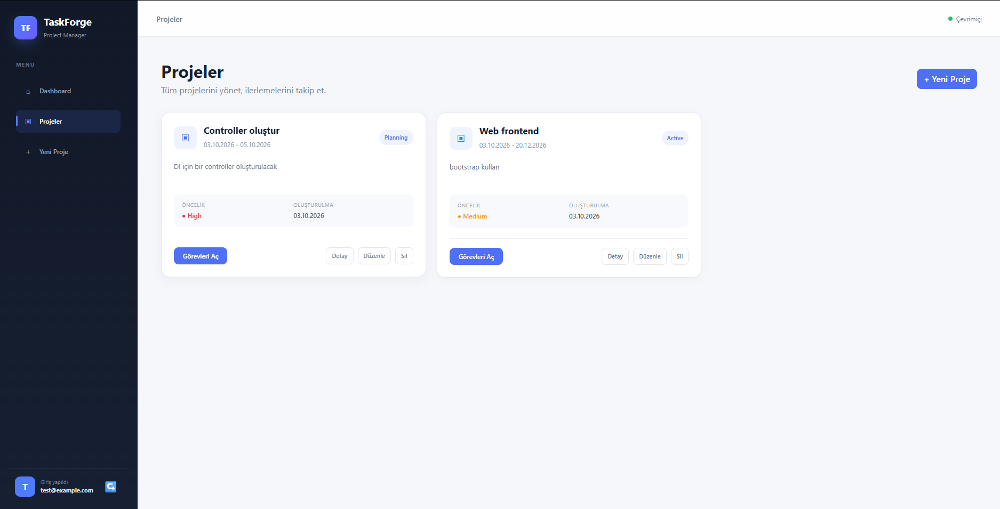
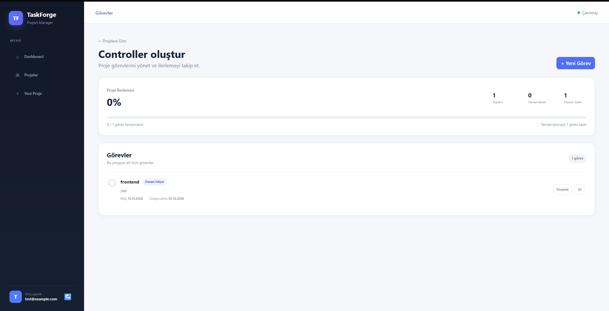
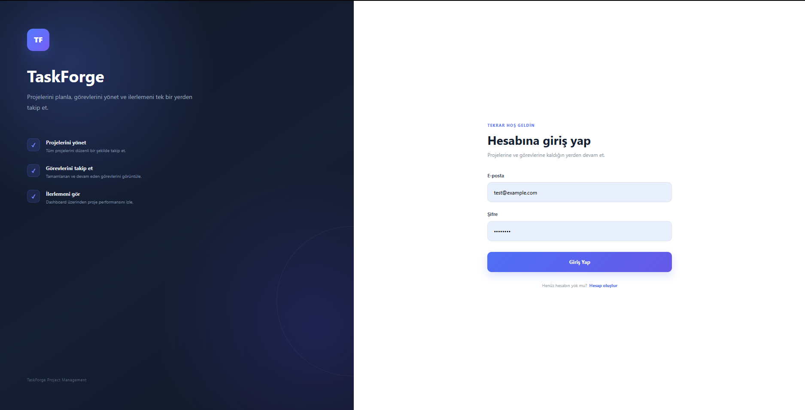

# TaskForge

TaskForge is a modern project and task management web application built with ASP.NET Core MVC.

It allows users to securely manage their own projects, create and track tasks, monitor project progress, and view key statistics through a modern dashboard.

## Features

- User registration, login and logout with ASP.NET Core Identity
- User-specific project management
- Create, edit, view and delete projects
- Create, edit and delete tasks for each project
- Mark tasks as completed
- Project status and priority management
- Project and task validation
- Secure authorization and user-based data access
- Dashboard with project and task statistics
- Project progress tracking
- Responsive and modern user interface

## Technologies

- ASP.NET Core MVC
- C#
- Entity Framework Core
- SQL Server
- ASP.NET Core Identity
- Razor Views
- Bootstrap
- HTML5
- CSS3

## Screenshots

### Dashboard



### Projects



### Task Management



### Authentication



## Getting Started

### Prerequisites

Make sure you have the following installed:

- .NET SDK
- SQL Server
- SQL Server Management Studio (SSMS)
- Visual Studio 2022 or another compatible IDE

### Installation

1. Clone the repository:

```bash
git clone https://github.com/furkankariip/TaskForge.git
```

2. Open the solution:

```text
TaskForge.sln
```

3. Configure the database connection string in:

```text
TaskForge/appsettings.json
```

Example:

```json
"ConnectionStrings": {
  "DefaultConnection": "Server=YOUR_SERVER_NAME;Database=TaskForgeDb;Trusted_Connection=True;TrustServerCertificate=True;"
}
```

4. Apply the Entity Framework Core migrations:

```powershell
Update-Database
```

Alternatively, using the .NET CLI:

```bash
dotnet ef database update
```

5. Run the application.

6. Create a new account and sign in to start managing projects and tasks.

## Security & Authorization

TaskForge uses ASP.NET Core Identity for authentication.

Each project is associated with the authenticated user, and project operations are restricted to the owner of the project.

This prevents users from accessing or modifying projects that belong to other accounts.

## Database

The application uses SQL Server with Entity Framework Core.

Main application data includes:

- Users
- Projects
- Tasks
- Project status
- Project priority
- Task completion state

Database schema changes are managed through Entity Framework Core migrations.

## Architecture

TaskForge follows the ASP.NET Core MVC architecture:

```text
TaskForge
├── Controllers
├── Data
├── Models
├── Views
│   ├── Account
│   ├── Dashboard
│   ├── Projects
│   ├── TaskItems
│   └── Shared
├── wwwroot
├── Migrations
├── Program.cs
└── appsettings.json
```

## Project Status

TaskForge is currently a completed portfolio project. Additional improvements and features may be added in the future.
